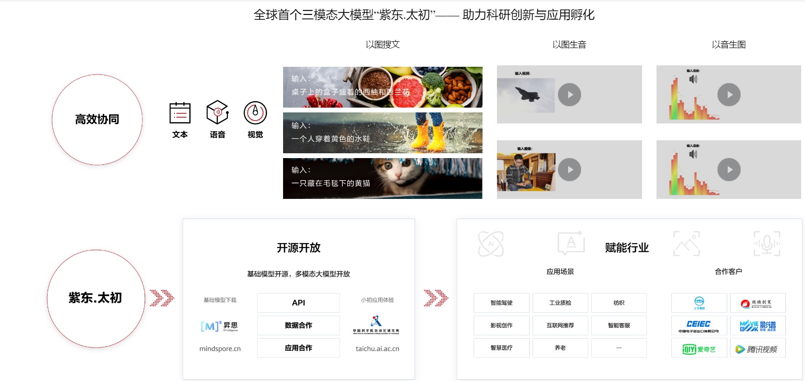

# 紫东.太初

#### 介绍
本仓是 **华为昇腾计算** 携手 **武汉人工智能研究院** 、 **中科院自动化所** 基于昇腾昇思（MindSpore）软硬件全栈打造的紫东.太初系列模型，是中科院自动化和华为在探索通用人工智能道路上的重要成果，并于2021年9月发布了全球首个图文音三模态千亿大模型，于2022年9月发布了业界最大中文多模态数据集紫东.太素，紫东.太初的发布将改变当前单一模型对应单一任务的人工智能研发范式，实现多模态的统一语义表达，在多模态内容的理解、搜索、推荐和问答，语音识别和合成，人机交互和无人驾驶等商业应用中具有潜力巨大的市场价值。

## 应用价值

