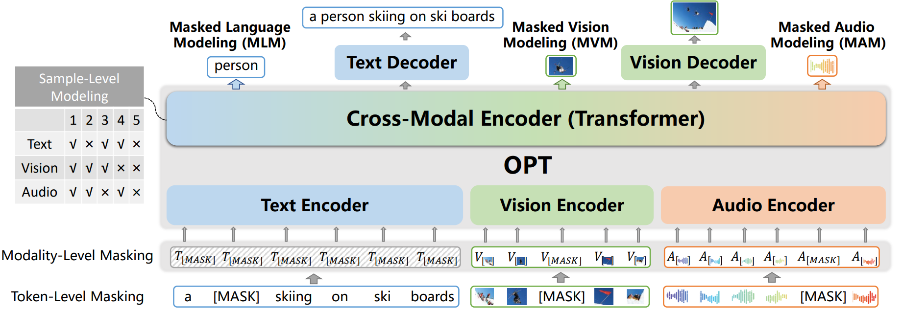
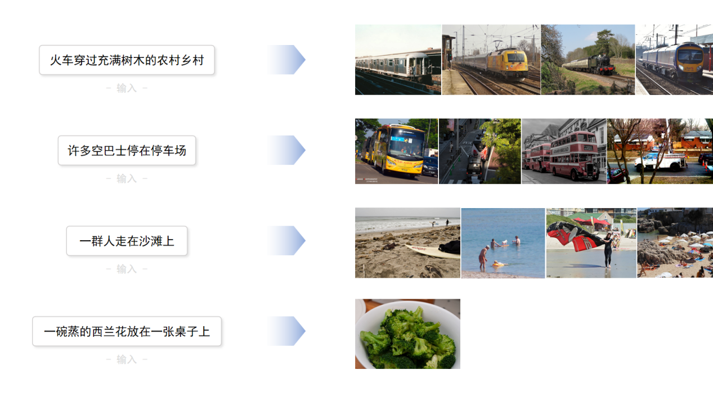
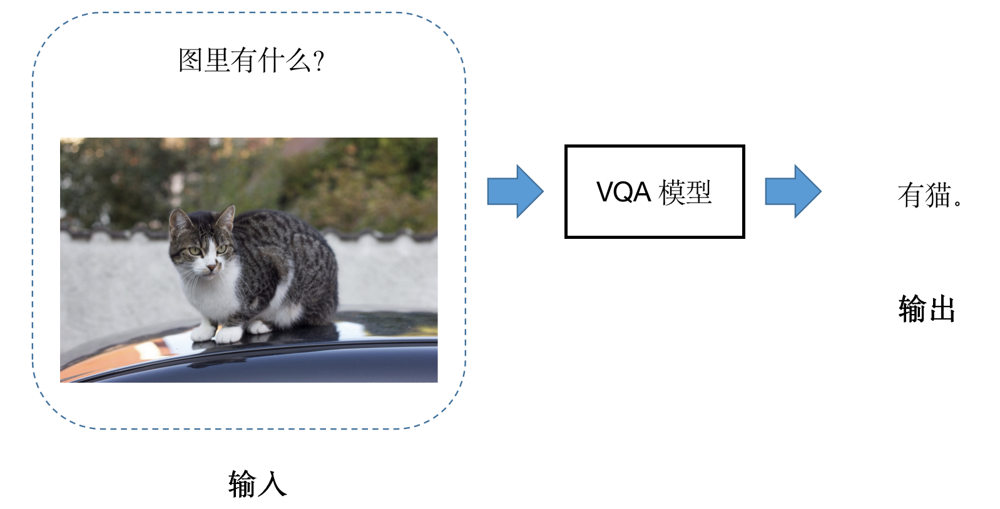
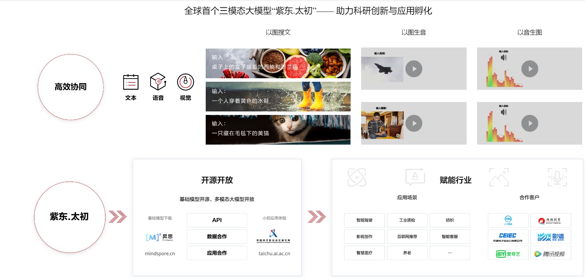

# OPT

## 项目介绍

OPT（Omni-Perception Pre-Trainer）是全场景感知预训练模型的简称，是中科院自动化和华为在探索通用人工智能道路上的重要成果，并在2021年9月发布了全球首个图文音三模态千亿大模型，中文名字叫紫东.太初，本仓是紫东.太初十亿参数级别代码，软硬件采用全国产华为昇腾全栈，包含预训练模型及多个下游任务模型。多模态模型可从不同模态（语音、图片、文字等）的数据中训练学习，从而完成许多应用广泛的AI任务，紫东.太初的发布将改变当前单一模型对应单一任务的人工智能研发范式，实现三模态图文音的统一语义表达，在多模态内容的理解、搜索、推荐和问答，语音识别和合成，人机交互和无人驾驶等商业应用中具有潜力巨大的市场价值。

## 模型架构

紫东太初的模型架构由特征提取模型、三个单模态编码器、一个跨模态编码器和两个跨模态解码器组成,并提出了三个级别的预训练任务：（1）Token级建模；(2) 模态级建模；(3) 样本级建模，详细内容可阅读论文了解，模型主体架构图如下：



## 环境安装

1. **安装CANN 5.0.4**  \
    前往昇腾社区下载安装包：\
    <https://www.hiascend.com/software/cann/commercial> \
    以arm + 欧拉的系统配置为例( **x86的系统请选择x86的包** ) \
    安装驱动： \
    ./A800-9000-npu-driver_21.0.4_linux-aarch64.run --full \
    安装固件： \
    ./A800-9000-npu-firmware_1.80.22.2.220.run --full \
    安装cann-toolkit包: \
    ./Ascend-cann-toolkit_5.0.4_linux-aarch64.run --full

2. **安装MindSpore 1.6.1版本** \
    前往MindSpore官网,按照教程安装对应版本即可，当前为1.6.1,链接如下: \
    <https://www.mindspore.cn/install>

3. **安装requirements依赖** \
    pip install -r requirements.txt

## 预训练

### 数据集介绍：

Base模型由MSCOCO、AIC、CC3M数据集训练。

其中是COCO Caption的数据集，自动化所将标签从英文翻译为中文，该数据集的训练集包括11.3万张图像，每张图像有5条描述的中文标签，测试集有5千张图像，每张图像5条描述的中文标签。

AIC数据集是大规模中文Caption数据集，包括21万训练集图像、3万验证集图像，每张图像有5条描述的中文标签，详细介绍见《AI Challenger : A Large-scale Dataset for Going Deeper in Image Understanding》。

CC3M数据集，自动化所将标签从英文翻译为中文，该数据集的训练集包括约300万张图像，实际下载280万左右，每张图像有1条描述的中文标签。


## 下游任务

- **1.  零样本跨模态检索（Zeroshot Cross-modal Retrieval）**
   
   任务简介：\
   跨模态检索是在不同模态之间进行数据的检索。\
   例如输入图片，在文本库中挑选出与图片内容最匹配的描述；输入描述，在图片库中挑出与这句描述内容最符合的图片。
   

   数据集介绍：该数据集是Flickr30K-CN数据，测试集包括1000张图像，每张图像5个中文描述文本。

   预训练模型与数据下载: \
   链接: https://pan.baidu.com/s/14a7lEK9aO4axoHevZSTs7A?pwd=xm1u \
   将模型和数据按照如下目录存放
    
    ```
    ${CODE_PATH}/
    ├── pretrained/
    └── dataset/
            ├── image/
            │     ├── flickr30k-images
            │     └── mscoco
            └── text/
                  ├── flickr30k_test_zh_token.json
                  ├── bert-base-chinese-vocab.txt
                  ├── json_coco_train_zh_token.json
                  └── meta.json
    ```

   启动测试：\
   bash scripts/test_retrieval_zeroshot.sh

   评估结果：

    |模型 | 数据量 |  IR @1  |  IR @5   |  IR @10   |  TR @1   |  TR @5   |  TR @10  |
    |:---:|:---:|:---:|:---:|:---:|:---:|:---:|:---:|
    |Wukong ViT-B/32 |  100M | 45.7  |  73.8  |  82.2  |  66.2  |  88.7  |  94.3   |
    |Wukong ViT-L    |  100M | 51.7  |  78.9  |  86.3  |  76.1  |  94.8  |  97.5   |
    |R2D2 ViT-L      |  23M  | 55.9  |  83.5  |  90.6  |  70.2  |  94.1  |  97.6   |
    |R2D2 ViT-L      |  250M | 60.9  |  86.8  |  92.7  |  77.6  |  96.7  |  98.9   |
    |CN-CLIP ViT-B/16|  200M | 62.7  |  86.9  |  92.8  |  74.6  |  93.5  |  97.1   |
    |**OPT ViT-B/16**|  3M   | **69.6**  |  **90.3**  |  **94.7**  |  **85.1**  |  **97.4**  |  **99.1**   |

- **2.  图像描述（Image Caption）**
   
   任务简介：\
   输入图片,生成对应的文字描述。\
   

   数据集介绍：该数据集是MSCOCO数据。

   预训练模型与数据下载: \
   链接: https://pan.baidu.com/s/1nFfT3zYyKWhDBxcRoiauvw?pwd=tic6 \
   将模型和数据按照如下目录存放
    
    ```
    ${CODE_PATH}/
    ├── pretrained/
    └── dataset/
            ├── image/
            │     ├── flickr30k-images
            │     └── mscoco
            └── text/
                  ├── bert-base-chinese-vocab.txt
                  ├── json_coco_train_zh_token_for_cap.json
                  ├── json_coco_test_zh_token_for_cap.json
                  ├── json_coco_trans_captions.json
                  ├── ids_to_tokens_zh.json
                  └── meta.json
    ```

   启动训练和测试：\
   bash scripts/fintune_caption.sh
   bash scripts/test_caption.sh

- **3.  视觉问答（Visual Question Answering）**
   
   任务简介：\
   输入图片和文字问题,生成对应的文字回答。\
   

   数据集介绍：该数据集是百度发布的中文VQA数据集 FM-IQA，图片来自于COCO，每张图片对应一到两个问题。

   预训练模型与数据下载: \
   链接: https://pan.baidu.com/s/1nFfT3zYyKWhDBxcRoiauvw?pwd=tic6 \
   将模型和数据按照如下目录存放
    
    ```
    ${CODE_PATH}/
    ├── pretrained/
    └── dataset/
            ├── image/
            │     ├── flickr30k-images
            │     └── mscoco
            └── text/
                  ├── bert-base-chinese-vocab.txt
                  ├── FM-IQA_train_token_ids_for_vqa.json
                  ├── FM-IQA_val_token_ids.json
                  ├── FM-IQA.json
                  ├── ids_to_tokens_zh.json
                  └── meta.json
    ```

   启动训练和测试：\
   bash scripts/fintune_vqa.sh
   bash scripts/test_vqa.sh

## 模型创新

- 全球首个多模态图文音预训练大模型

- 多层次多任务自监督学习

- 弱关联多模态数据语义统一表达

- 兼顾任务感知和推理增强的中文预训练模型

- 多粒度学习与注意力指导的视觉预训练模型

- 基于自监督预训练的多任务语音建模技术

## 应用价值



## 引用说明

如果你使用了该项目，请引用该论文，论文链接：<https://arxiv.org/abs/2107.00249>  

## 免责声明

MindSpore（“我们”）不拥有数据集的任何所有权或知识产权，并且经过训练的模型是在“原样”和“可用”的基础上提供的。我们不对任何类型的数据集和经过训练的模型（统称为“材料”）作出任何陈述或保证，并且不对材料引起的任何损失、损害、费用或成本负责。请确保您有权根据数据集的相应许可和相关许可协议的条款使用数据集。提供的训练模型仅用于研究和教育目的。

致数据集所有者：如果您不希望 MindSpore 中包含数据集，或希望以任何方式对其进行更新，我们将根据您的要求删除或更新内容。请通过 GitHub 或 Gitee 联系我们。非常感谢您对社区的理解和贡献。

MindSpore 在 Apache 2.0 许可下可用，请参阅 LICENSE 文件
